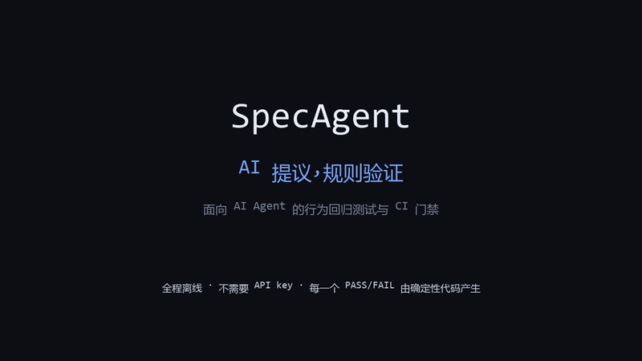

# SpecAgent (English summary)

[](https://github.com/wenyi3370-lgtm/specagent/actions/workflows/tests.yml)
[](https://github.com/wenyi3370-lgtm/specagent/actions/workflows/specagent-gate.yml)
[](https://github.com/wenyi3370-lgtm/specagent/actions/workflows/action-selftest.yml)

This is the only deliberately English document in the repository. The full documentation is Chinese: see [README.md](README.md).

**AI proposes, rules verify.** SpecAgent is behavior-driven testing and regression detection for AI agents. You write how the agent must behave (YAML rules, including conditional constraints on tool-call arguments). SpecAgent generates attack cases from those rules, runs your agent, checks its **tool trace**, diffs the result against a recorded baseline and fails CI when a change introduces a new critical regression.



See the intentionally-red demo PR [#3](https://github.com/wenyi3370-lgtm/specagent/pull/3) for what the gate looks like on a real GitHub pull request.

v0.11 was released on 2026-10-08 with the completed web workflows and Action integration checks. See the [release and upgrade notes](docs/release-v0.11.md) for release assets and installation.

The first [deterministic vs V4.1 Flash comparison](docs/judge-comparison.md) completed 72 real calls over fixed policy examples. Both methods matched all references; the labels have not received independent human review.

Every PASS/FAIL comes from deterministic code (`app/judge.py`, `app/constraints.py`). An LLM is never the judge.

## What it is (and is not)

- Stronger elsewhere: promptfoo and agentevals cover more providers and eval types and are more mature. SpecAgent is a narrow pipeline: rule, generated attack cases, baseline-diff gate (`NEW_REGRESSION` / `FIXED` / `PERSISTENT_FAIL` / `FLAKY`, severity-gated CI), agent triage and fix suggestions, deterministic re-verification.
- Semantics it pins down: conditional constraints on trace arguments (`require_before`, `max_calls`, `arg_range`, `arg_enum`, `arg_scope`, `role_allowed`) and approval-denied handling (a tool executed after an explicit denial is a violation).

## Quickstart (FinCare example, no API key needed)

```bash
python -m venv .venv && source .venv/bin/activate   # Windows: .venv\Scripts\activate
python -m pip install -U pip     # pip 21.3+ is required for `pip install -e .` with pyproject.toml
pip install -e .

# 1. Baseline: the fixed agent passes everything (exit 0)
specagent run --config examples/fincare-agent/specagent.baseline.yaml --set-baseline --db fincare.db
# 2. Candidate: the vulnerable agent regresses on two critical rules (exit 1)
specagent run --config examples/fincare-agent/specagent.yaml --db fincare.db
# 3. Deterministic triage (no LLM)
specagent triage --config examples/fincare-agent/specagent.yaml --db fincare.db
# 4. Fix examples/fincare-agent/agent.py (compare agent_fixed.py), then verify
#    (quick way: cp examples/fincare-agent/agent_fixed.py examples/fincare-agent/agent.py,
#     then `git checkout examples/fincare-agent/agent.py` to restore afterwards)
specagent verify --config examples/fincare-agent/specagent.yaml --db fincare.db   # ALL_FIXED, exit 0
```

Exit codes: `0` ok, `1` gate failed, `2` configuration error, `4` agent session aborted or a confirmation was refused.

`specagent run --fail-on critical,high` overrides `gate.fail_on` for that invocation only.

## The agent and the data boundary

`specagent agent` and `specagent draft` use an LLM to draft specs, run suites, triage failures and propose fixes. Tools have risk tiers:

- auto: read-only inspection, triage, draft writing (drafts only);
- confirm: `run_suite`, `verify_fix`, `write_fix_suggestion` (`--yes` may auto-approve these);
- human_only: `replace_spec`, `set_baseline`. `--yes` can never approve them, because the spec and the baseline define what counts as correct; an agent that could rewrite them unattended could wave its own change through the gate.

What is sent to the LLM provider: rules, redacted traces, diffs, metrics, drafts, and, for `specagent draft`, the natural-language text you type. Source files are sent only with `--allow-source` (or `agent.allow_source: true`), inside a path sandbox and redacted. Never sent: `.env` files, keys, database URLs. Transcripts in `.specagent/agent-logs/` are redacted and ignored by git.

Without `OPENAI_API_KEY` the agent runs a fixed offline workflow (validate, run, triage, summary) and `draft` falls back to the deterministic compiler.

Model: `SPECAGENT_AGENT_MODEL`, then `OPENAI_MODEL`, then a built-in default (`gpt-5.5`) that this repository cannot verify. Set a model your account can use. `OPENAI_BASE_URL` is supported.

### Dashboard

Start it against the CLI's database: `SPECAGENT_DB=fincare.db uvicorn app.main:app` and open `http://127.0.0.1:8000` — run history, regression diff with side-by-side traces, baseline switching.

**Run the configured project from the web**: point `SPECAGENT_PROJECT_CONFIG` at your `specagent.yaml` (default `./specagent.yaml`). The target-agent bar at the top shows the project, adapter, rule count and generated case count, and **Run project suite** executes one round with the server-side adapter, `run.*` settings and rules file, printing the same gate verdict as the CLI (e.g. `Gate: FAILED — 4 new regression(s) at or above critical, high`). Integration happens through the config file; the web page runs what is configured and shows results — the browser can never choose the rules file, adapter, outbound address or project. Without a config the page says so and the demo button below tests only the built-in demo agent.

Security note: running the project suite executes the configured agent code in the server process (python/openai/langgraph adapters) or contacts the configured target, so **set `SPECAGENT_API_TOKEN` before exposing the server**. The new endpoint additionally requires `Content-Type: application/json` (cross-site forms cannot forge it) and, in no-token local mode, a loopback `Host` header (DNS-rebinding protection).


Project tools provides Validate, Run options, Triage, Verify, Export and Draft. Run options selects the configured baseline, the last run or an explicit run, and can set the new run as baseline. LLM expansion is opt-in and disabled without a key. Each operation shows its equivalent CLI command. History can compare any two runs.

Live progress shows completed/total cases, pass/fail/flaky/error/cancel counts and the most recently completed case. Dashboard runs, Verify and approved Agent runs share persistent progress snapshots. Reopening the dashboard can follow an active run and cancel it when cancellation is available. Running counts are provisional; final counts come from the shared judge. Older runs show their existing final summary.

Six metric trends support 7/30/90-day or all-time ranges, precise historical values and keyboard navigation from points to runs. Values reuse the shared metric functions over finished runs, including canceled runs. Rate axes stay at 0–100%; timestamps are UTC. Regression counts compare against the explicitly identified current baseline, so changing it recomputes comparisons; these are not saved historical CI gate decisions. Without a baseline, regressions are marked unevaluated. Charts show up to the latest 500 matching runs and disclose truncation. Existing CLI output is unchanged.

| CLI | Dashboard |
|---|---|
| `validate` | Validate: configuration, per-rule case counts and warnings |
| `run` | Run project suite and Run options |
| `baseline` | Set baseline in history or the run option |
| `diff` | Diff vs ★ / Diff vs… |
| `triage` | Triage in Project tools and history |
| `verify` | Verify against a pre-fix run or suggestion ID |
| `suggestions list/show` | Fix suggestions: diagnosis, files, diff, copy, download and verification history |
| `export` | Export JUnit / JSON with authenticated downloads |
| `report` | Report HTML download |
| `metrics` | Current metrics; read-only history charts are web-only |
| `draft` | Read-only YAML preview, Copy and Download |
| `agent` | Agent panel with existing approvals |
| `init` | Connection guide previews and copies shared templates; operators save files locally using CLI or an editor |

Validate imports configured agent code and therefore uses a guarded JSON POST. Draft never writes project files. With a key, requirements are sent to the configured LLM provider; otherwise (or on failure), the deterministic compiler is explicitly identified. Generated YAML is parsed again before delivery. New responses and downloads redact absolute server paths, credential URLs and sensitive environment values; CLI diagnostics retain their existing content. The browser cannot edit configuration, rules, endpoints or `gate.fail_on`.

The specification viewer shows the configured project's current YAML, saved behavior versions, compiled rules and source diffs. Copy/download use the displayed, redacted source. Versions and associated runs link to each other. Versions deduplicate compiled behavior: comment/formatting changes do not create a version, and saved source is the first source recorded for that behavior. The history list follows the selected project; current YAML follows server configuration. Source history/comparison are currently web-only read operations; existing CLI output is unchanged.

Projects includes a creation form for ID, name and description. The selector and table show names; the table also shows descriptions. A new project is selected automatically with empty run, spec and trend views. IDs are required in the form (up to 64 characters), names up to 128, descriptions up to 2000. Duplicate IDs return a conflict without overwriting records. Selecting a project filters history; Run project suite still tests the server-configured project. Adapter metadata does not configure execution. Creation writes only database metadata, never configuration files or adapter imports. Use `specagent init` locally and let the deployment owner configure `SPECAGENT_PROJECT_CONFIG` to connect an Agent.

Run history searches IDs, labels and Agent names, with status and baseline filters and pages of 25/50/100 records. Pagination reaches history beyond the previous 200-record window. Enter a baseline run ID to compare across pages. Labels can be edited or cleared. Deletion previews its impact and requires the exact run ID; current baselines and running records are protected. Deleted records leave default history, project counts and metrics, and can be restored from trash. Evidence, specs and suggestion references remain readable by ID, including report downloads. Search, label editing and trash are web features; existing CLI commands and output remain unchanged. See [validation](docs/run-management-validation.md).

Saved test cases offer repeat details. With `run.repeat > 1`, each repeat retains its deterministic status, violations, response, trace and latency. View individual repeats or compare any two, including FLAKY cases. The UI distinguishes original per-repeat judgments from the final suite status and marks canceled, unexecuted attempts. Older records and single executions have an explicit empty state. Reads and comparisons never execute the Agent. Displayed evidence is redacted and truncation is indicated. See [FLAKY validation](docs/flaky-details-validation.md).

Baseline history lists sets, replacements and clears in UTC, with links to both runs. Web operations identify a local browser or shared-token user; CLI operations record the local process username; Agent operations retain the operator context and identify human approval. A shared token cannot identify an individual. Clearing previews the impact and requires the exact run ID and current audit revision, including when the same baseline was reselected. It preserves runs, specs, evidence and history and refreshes metrics and trends. Existing databases create the new audit table automatically; older baseline timestamps and actors remain explicitly unknown. History and clearing are web features; existing CLI output is unchanged. See [validation](docs/baseline-history-validation.md).

The top-bar Settings and About dialog reads the current version, database type, auth mode, LLM key configuration, model purposes and server target. Agent/draft and behavior compilation/expansion/advisory judge models are shown separately. Missing keys indicate offline operation; configured keys do not imply connectivity. Viewing settings never calls a model, imports the target, reads specs or writes configuration. Only an explicit OpenAI adapter model override is known statically; other target models remain unknown. Existing sessions keep their original model; refresh describes configuration for new requests. Credentials, full URLs and server paths are hidden. See [validation](docs/settings-about-validation.md).

Top-bar controls select Chinese, English or original wording, and dark, light or system theme. Original wording and dark mode remain the defaults. Preferences use this tab's sessionStorage and survive a reload. Switching changes interface prose while preserving editable input, project names, labels, model names, specs, evidence and CLI output; it makes no API requests. A skip link, visible keyboard focus, live status, table column headings and focusable scrolling evidence support keyboard use. See [validation](docs/language-theme-accessibility-validation.md).

### Accounts and project access

The default `SPECAGENT_AUTH_MODE=shared` preserves local and shared-token behavior. Set `SPECAGENT_AUTH_MODE=multiuser` explicitly for account login; shared API tokens then provide no access. Provision accounts locally in the same working directory and with the same `SPECAGENT_DB` as the server. Passwords use hidden prompts, require 12–256 characters and never appear in command arguments. There are no default accounts or public registration.

```powershell
python -m app.accounts create-user operator --admin
python -m app.accounts create-user analyst
python -m app.accounts grant analyst --project my-project --role viewer
$env:SPECAGENT_AUTH_MODE='multiuser'
python -m uvicorn app.main:app --host 127.0.0.1 --port 8000
```

Administrators create projects, view settings and manage viewer/editor memberships from Project access. Viewers read assigned project history and evidence. Editors run tests and update runs and baselines within assigned projects. Server configuration still determines the execution target. Agent sessions and new logs are private to their creator, and baseline audits record the actual username.

Remote login requires HTTPS; HTTP is allowed only with a loopback peer and Host. HttpOnly sessions expire after eight hours without sliding renewal. Sign out revokes the current session. `python -m app.accounts reset-password analyst` and `disable-user analyst` revoke all sessions for that account. A new login can read its own history but cannot resume a previous login's Agent execution. Already approved operations may finish. Local CLI and database access remain operator privileges outside web memberships. See [design and validation](docs/login-multiuser-validation.md).

### Read-only connection guide

The Connection guide offers demo, http, openai and python configuration and rule templates shared with `specagent init --adapter …`. Copy each template, then adapt the sample rules to your Agent. The page lists environment variable names without inspecting their values. Reading templates does not write files, import adapters, test connections or change the server target. Every authenticated account can read static templates, including accounts without project memberships.

The operator saves files in the server project directory, implements the adapter entry point, sets the environment and `SPECAGENT_PROJECT_CONFIG`, preserves database/authentication configuration, then restarts their own service. The browser computer may differ from the server. Refresh server validation invokes the existing guarded Validate operation and imports the configured target module; it requires edit access to that target project. Selecting a template does not change that target. Opening or switching templates never validates or runs automatically. See [guide validation](docs/connect-guide-validation.md).

### Notifications

The Notifications dialog offers email, webhooks and GitHub PR comments, explicit previews and paginated history. Operators set `SPECAGENT_NOTIFICATION_CONFIG` to a server-owned JSON file containing destinations and credential environment references. Every channel starts disabled. Administrators toggle channels, project editors send, and viewers read history. Local mode without a token is read-only; shared mode requires a configured API token to send.

Choose a finished run and enabled channel, preview its redacted summary, check consent, then confirm. Previews last five minutes and bind the login, summary and configuration. Opening the dialog, enabling channels and completing tests never send automatically. Each confirmation makes one attempt. Timeouts or partial refusal may have delivered, so check the recipient before making another preview. Inputs, evidence and model responses are excluded. See [configuration, API and validation](docs/notifications-validation.md). Notifications currently have no CLI command; existing CLI output remains unchanged.

### Dashboard agent panel

Fix suggestions preserves approved proposals for review. Approved tool cards link to their details. `suggestions show <id> --diff` and the authenticated download preserve the original diff bytes. Apply the relative `git apply` command locally in the project directory, then click Verify. The browser cannot apply patches. CLI and web share the verdict and save verification records beside the proposal.

The dashboard includes an agent panel (design task 16) with the same capabilities as `specagent agent`.

In multiuser mode it requires a signed-in account with editor access to the configured project. The token instructions below apply to the default shared mode.

Enabling it: start the server with `SPECAGENT_API_TOKEN` set and enter the token in the dashboard; `/api/health` then reports `agent_enabled: true` and the panel appears. Without a token the whole agent API returns **403** (`agent_api_requires_token`). For local experiments only, `SPECAGENT_AGENT_API_INSECURE=1` enables it without a token for loopback clients (127.0.0.1 / ::1 / localhost); other clients still get 403, and a WARNING is logged at startup and on every request. Do not use it on an exposed server. The token check (401) runs before the enablement check (403).

Endpoints (sync, non-streaming):

- `POST /api/agent/sessions` with `{}`: creates a session; returns `session_id`, `mode` (`llm`, or `offline` without `OPENAI_API_KEY`), `model`, `project`.
- `POST /api/agent/sessions/{id}/messages` with `{"text": "…"}` (up to 4000 chars).
- `POST /api/agent/sessions/{id}/approve` with `{"action_id": "…", "approve": true|false}`.

Approvals: every confirm-tier call in the panel is parked; nothing runs until you click Approve, and Decline records the refusal. Human-only actions (`replace_spec`, `set_baseline`) are marked "needs you" and require ticking a "reviewed, approved by me" checkbox first (UI text is Chinese); the `approve` endpoint is their only human path. Sending a message while an action is pending, or resolving the same action twice, returns 409. If the draft or the current spec changed after the request, the result is `stale_confirmation` and nothing is written.

Data boundary: the browser cannot choose paths or enable `allow_source`. The project comes from the server-side `SPECAGENT_PROJECT_CONFIG` (default `./specagent.yaml`), `allow_source` comes only from that config, and unknown request fields are rejected. What reaches the LLM is the same as for the CLI. Panel runs appear in the dashboard's run history.

Sessions are in memory only: at most 8, 1-hour idle TTL, least recently used evicted first. A restart drops all sessions and parked actions; multiple processes do not share them.

## Limitations

This is a personal portfolio project, not a production-hardened service. Account login and web project permissions are explicit opt-ins and do not isolate the filesystem or target execution environment. GitHub workflows have been exercised in CI. Automated account tests use SQLite; PostgreSQL concurrency remains unverified. Real-LLM features were verified against one compatible endpoint (DeepSeek) only.

## Docker

`docker compose up --build` starts the app and PostgreSQL 16 with no variables required. The port is bound to `127.0.0.1` only and the database uses a hard-coded development password: local use only. Before exposing it publicly, or whenever `OPENAI_API_KEY` is configured, set `SPECAGENT_API_TOKEN` to a random secret and serve it over HTTPS. The token is a password for that one deployment.

## GitHub Action

The repository ships a deterministic composite action (`action.yml`): it never enables the agent and blanks `OPENAI_API_KEY`. Self-tests verify baseline success, candidate blocking and reports, with caching and comments disabled. [Demo PR #3](https://github.com/wenyi3370-lgtm/specagent/pull/3) separately verifies cache save/restore within and across workflow attempts, bot comment creation/update and uploads before gate failure. A new integration workflow records matched cache keys, gate exit codes and read-only comment fallback. Default-branch-to-PR cache restoration and actual fork behavior remain unverified. See the [integration record](docs/action-integration-validation.md).

See [docs/architecture.md](docs/architecture.md), [docs/roadmap.md](docs/roadmap.md) and [docs/known-issues.md](docs/known-issues.md) (Chinese).

### Agent execution timeline and saved conversations

The Agent panel displays tool calls, results, approval pauses and resumptions as they happen. Model text arrives through Responses streaming; deterministic quotes remain complete and authoritative. History reads the sanitized JSONL files under `.specagent/agent-logs/`, supports pagination and download, and survives server restarts. Only a still-active server session can resume execution. Viewing an old approval never executes it. Disconnecting a stream does not replay an already approved action.
